# 📋 Laporan Audit Komprehensif: UI/UX, Responsivitas, & Kecepatan Load Data
**Grand Kota Bintang — Premium Living Superblock & Residential**

Laporan audit ini dibuat oleh **Antigravity AI (UI/UX & Modern Landing Page Specialist)** untuk menganalisis kualitas antarmuka (UI), pengalaman pengguna (UX), kesesuaian responsivitas perangkat mobile, serta performa pemuatan data pada landing page **Grand Kota Bintang**.

---

## 📌 Ringkasan Eksekutif (Executive Summary)

Secara keseluruhan, landing page **Grand Kota Bintang** dirancang dengan konsep **"Quiet Luxury"** yang sangat baik. Penggunaan skema warna *Midnight Navy* (`#0A1931`) dan *Champagne Gold* (`#C5A880`) memberikan kesan eksklusif, elegan, dan profesional (sangat cocok untuk properti kelas atas). Struktur kode React modular, pemisahan data dari UI, serta implementasi aksesibilitas (seperti *skip links* dan manajemen fokus pada *smooth scroll*) adalah praktik terbaik tingkat lanjut yang patut diapresiasi.

Namun, terdapat beberapa **temuan kritis (bottlenecks)** yang berdampak signifikan pada pengalaman pengguna di perangkat mobile dan kecepatan pemuatan halaman (Core Web Vitals).

### 📊 Skor Penilaian Teoretis (Audit Scores)
| Kategori Audit | Skor | Status | Catatan Utama |
| :--- | :---: | :---: | :--- |
| **User Interface (UI) Aesthetics** | **9.0 / 10** | ✨ Sangat Baik | Estetika mewah konsisten, kontras teks utama aman. |
| **User Experience (UX) & Usability** | **7.5 / 10** | ⚠️ Butuh Perbaikan | Kendala presisi input KPR, *redundancy* tombol WhatsApp mobile, & *blank state* pada Tur Virtual. |
| **Mobile Responsiveness** | **8.5 / 10** | 👍 Baik | Skala *grid* adaptif sangat baik, navigasi bawah jempol (*Sticky Nav*) responsif. |
| **Pemuatan Data & Performa (LCP)** | **5.5 / 10** | 🚨 Kritis | Payload gambar sangat berat (2.06 MB) dan CDN pemblokir rendering di `<head>`. |
| **Aksesibilitas (a11y) & SEO** | **8.5 / 10** | 👍 Baik | Struktur heading mantap, form sudah *accessible*, perlu optimalisasi tag HTML semantik. |

---

## 🎨 1. Audit Estetika & Kontras Warna (UI/UX Color Audit)

Komponen warna yang dipilih sangat premium, namun ada beberapa elemen yang memiliki **rasio kontras rendah** atau berpotensi **"tenggelam" (washed out)** ketika dipadukan dengan latar belakang dinamis (gambar).

### 🔍 Analisis Kontras Elemen Kritis (WCAG 2.1 Compliance)

| Elemen Antarmuka | Warna Latar Belakang (BG) | Warna Teks / Icon | Rasio Kontras | Status WCAG | Temuan & Rekomendasi |
| :--- | :--- | :--- | :---: | :---: | :--- |
| **Tombol Utama (Primary CTA)** | `#C5A880` (Gold) | `#0A1931` (Navy) | **7.83 : 1** | ✅ AAA (Lolos) | Sangat kontras dan mudah dibaca baik di desktop maupun mobile. |
| **Teks Utama (Body Text)** | `#F8F9FA` (Off-white) | `#5C677D` (Slate Muted) | **5.43 : 1** | ✅ AA (Lolos) | Lolos standar minimal AA (4.5:1). Namun, untuk pengguna dengan gangguan penglihatan ringan, teks ini terasa agak tipis. Disarankan menggelapkan sedikit ke `#475569` (rasio **6.75:1**). |
| **Hero Badge (Akses Emas)** | `rgba(197, 168, 128, 0.2)` + Sky Image | `#E2D5C3` (Gold Light) | **Rendah (~2.5:1)** | 🚨 Gagal | **Tenggelam!** Karena latar belakang Hero adalah foto sunset townhouse (`cluster_marocco.png`) yang memiliki bagian langit oranye terang/putih, teks emas muda di atas badge semi-transparan ini menjadi sangat sulit dibaca akibat minimnya kontras visual. |
| **Informasi Angsuran KPR** | `#0A1931` (Navy) | `rgba(255, 255, 255, 0.6)` | **6.96 : 1** | ✅ AA (Lolos) | Cukup kontras untuk teks sekunder pada panel hasil kalkulator KPR. |

> [!WARNING]
> **Temuan UI Kritis pada Hero Badge:**
> Latar belakang gambar Hero memiliki kecerahan tinggi di area langit. Penggunaan teks emas muda (`#E2D5C3`) di atas latar belakang transparan emas (`rgba(197, 168, 128, 0.2)`) melanggar aturan aksesibilitas kontras.
> **Rekomendasi Perbaikan:** Ubah teks di dalam `.hero-badge` menjadi `#FFFFFF` dengan bayangan teks tipis, atau buat warna latar belakang badge lebih gelap (`rgba(7, 15, 30, 0.65)`) untuk meningkatkan keterbacaan teks emas.

---

## 📱 2. Audit Responsivitas Perangkat Mobile (Responsiveness Audit)

Tata letak CSS adaptif menggunakan media queries `@media (max-width: 768px)` sudah dikonfigurasi dengan sangat matang. Namun, ada masalah fungsionalitas dan redundansi visual pada layar sentuh mobile.

### 🚫 Redundansi CTA WhatsApp di Perangkat Mobile
Pada layar lebar (desktop), tombol **Floating WhatsApp** di pojok kanan bawah sangat berguna. Namun, pada layar mobile (`< 768px`), landing page ini mengaktifkan **dua pemicu WhatsApp sekaligus**:
1. **Floating WhatsApp Button** (dibuat melayang pada `bottom: 86px; right: 20px;`).
2. **Sticky Bottom Mobile Nav Bar** yang memiliki ikon tengah **"Chat Sales"** (berwarna hijau `#25D366` dengan bayangan mencolok).

```
+-----------------------------------+
|                                   |
|   [ Form / Konten Utama ]         |
|                                   |
|               ( WA Floating ) <---+-- GANGGUAN VISUAL!
|  ===============================  |
|  [Proyek] [Lokasi] [WA] [KPR] [Co]| <--- WA Center Cukup di Sini!
+-----------------------------------+
```

> [!IMPORTANT]
> **Dampak UX:** Pemuatan dua tombol WhatsApp yang berdekatan membuat layar mobile terasa sangat sesak (*cluttered*), berpotensi menutupi teks penting di bawahnya, dan memberikan kesan *spammy*.
> **Rekomendasi Perbaikan:** Sembunyikan tombol Floating WhatsApp (`.floating-whatsapp-btn`) khusus pada perangkat mobile menggunakan media query:
> ```css
> @media (max-width: 768px) {
>     .floating-whatsapp-btn {
>         display: none !important;
>     }
> }
> ```

---

## ⚙️ 3. Audit Pengalaman Pengguna & Alur Interaksi (UX Usability Audit)

Ada dua komponen interaktif utama yang memiliki kelemahan kegunaan (*usability gaps*) yang dapat menurunkan tingkat konversi prospek (*leads conversion rate*).

### 🧮 A. KPR Calculator: Kendala Presisi Input Range Slider
Kalkulator KPR hanya menyediakan **Range Slider** tanpa opsi input manual angka (text input) untuk harga properti dan uang muka (DP).
* **Masalah:** Rentang slider harga properti sangat besar (Rp 1 Miliar hingga Rp 10 Miliar, selisih 9 Miliar) dengan kelipatan 50 Juta (total ada 180 langkah). Pada layar HP selebar 360px, lebar slider fisik hanya sekitar 200px. Artinya, **1 langkah presisi berukuran kurang dari 1.2 pixel!**
* **Dampak UX:** Pengguna di mobile akan sangat kesulitan menggeser slider dengan ibu jari untuk mendapatkan angka presisi (misalnya pas Rp 1.85 Miliar). Mereka akan merasa frustrasi karena slider terlalu sensitif.
* **Solusi Premium:** Sediakan kolom input numerik (`<input type="number">`) kecil di samping label harga properti agar pengguna memiliki alternatif mengetikkan angka eksak selain menggeser slider.

### 🕶️ B. Virtual Tour 360°: "Blank State" Tanpa Loading Indicator saat Memuat Iframe
* **Masalah:** Komponen `VirtualTour.jsx` memuat aset 3D yang sangat berat menggunakan Iframe secara dinamis setelah pengguna mengklik *"Mulai Tur Virtual Sekarang"*. 
  Setelah diklik, state `stage` langsung berubah dari `idle` ke `active` (setelah delay 400ms). Hal ini menyebabkan overlay gambar preview langsung **hilang**, sementara Iframe aslinya masih mengunduh data 3D dari server eksternal (memakan waktu 3-8 detik tergantung koneksi). Selama proses unduh tersebut, area Iframe hanya menampilkan **kotak kosong biru tua (blank)** tanpa indikasi loading.
* **Dampak UX:** Pengguna mengira aplikasi rusak atau tidak merespons karena layar tiba-tiba kosong setelah tombol diklik.
* **Solusi Premium:** Tetap tampilkan animasi pemutar/loading spinner (`fa-spinner fa-spin`) di tengah wadah tur virtual sampai event `onLoad` pada Iframe benar-benar terpicu (`iframeLoaded === true`).

---

## 🚀 4. Audit Kecepatan Load Data & Performa (Web Performance / LCP Audit)

Masalah performa adalah titik paling kritis pada landing page ini. Halaman terasa lambat dimuat pertama kali karena ukuran aset gambar yang tidak dioptimalkan dan pemblokiran render oleh pihak ketiga.

### 🖼️ A. Ukuran Gambar yang Luar Biasa Berat (Image Payload Bottleneck)
Total ukuran aset gambar yang harus diunduh oleh browser saat pertama kali dibuka adalah **2.06 MB**! Ini adalah ukuran yang sangat besar untuk sebuah landing page satu halaman yang menargetkan konversi cepat.

```
Pemuatan Gambar Awal (Total: 2.06 MB)
├── stellar_avenue.png (About & Card)  ──> 1.06 MB (🚨 SANGAT BESAR)
├── cluster_marocco.png (Hero & Card)  ──> 888 KB  (🚨 SANGAT BESAR)
└── logo.png (Header & Footer)         ──> 109 KB  (Bisa Dikompres)
```

* **Dampak Performa:** 
  1. Di jaringan mobile 4G/3G yang lambat, gambar latar belakang Hero (`cluster_marocco.png`) akan dimuat baris demi baris secara lambat (*progressive rendering delay*), menyebabkan **Largest Contentful Paint (LCP)** buruk (> 4 detik).
  2. Gambar `stellar_avenue.png` yang berukuran 1.06 MB menyumbang pemborosan bandwidth yang sangat besar bagi pengguna mobile.
* **Rekomendasi Perbaikan:** 
  * Konversi seluruh gambar `.png` tersebut ke format modern **`.webp`** atau **`.avif`** dengan kompresi kualitas 80%. Hal ini akan memotong ukuran file hingga **80% - 90%** tanpa menurunkan kualitas visual yang terlihat oleh mata manusia!
  * Estimasi penghematan payload: **2.06 MB berkurang menjadi hanya ~350 KB!**

### ⏳ B. CDN Pemblokir Rendering di `<head>` (Render-Blocking Critical Path)
Di dalam `index.html`, browser dipaksa mengunduh stylesheet besar sebelum mulai menampilkan halaman:
1. **Font Awesome 6.4.0** (`all.min.css`): Mengunduh seluruh pustaka ikon pihak ketiga secara sinkron di bagian atas `<head>`. Padahal landing page ini hanya memakai belasan ikon.
2. **Leaflet CSS** (`leaflet.css`): Dimuat secara render-blocking di `<head>`, padahal komponen Peta (*Amenities Map*) berada di bagian bawah halaman (baru terlihat setelah di-scroll).
3. **Google Fonts Link**: Dimuat langsung tanpa optimasi preconnect yang efisien.

```mermaid
gantt
    title Garis Waktu Pemuatan Awal (Visualisasi Render-Blocking)
    dateFormat  X
    axisFormat %s
    section Mengunduh HTML
    HTML Document            :active, 0, 5
    section Memblokir Render
    FontAwesome CSS (Head)  :crit, 5, 20
    Leaflet CSS (Head)      :crit, 20, 32
    Google Fonts CSS (Head) :crit, 32, 45
    section Render Pertama
    First Contentful Paint  :milestone, 45, 0
    section Unduh Aset Berat
    stellar_avenue.png (1MB): 45, 95
    cluster_marocco.png (888K): 45, 88
    section Halaman Sempurna
    Largest Contentful Paint :milestone, 95, 0
```



> [!TIP]
> **Rekomendasi Optimasi Performa (LCP):**
> 1. **Tambahkan `fetchpriority="high"`** pada tag `` latar belakang Hero di `Hero.jsx` agar browser memprioritaskan unduhannya dibanding aset sekunder lainnya.
> 2. **Tunda (Defer) CSS Non-Kritis:** Muat Leaflet CSS secara dinamis di React menggunakan efek samping (`useEffect`) di dalam komponen `AmenitiesMap.jsx`, atau gunakan atribut `media="print" onload="this.media='all'"` pada tag `<link>` di `index.html` agar tidak memblokir render awal layar pertama (Hero).

---

## ♿ 5. Audit Aksesibilitas (a11y) & SEO (A11y & SEO Audit)

### 👍 Keunggulan Utama (Praktik Terbaik yang Sudah Diterapkan)
* **Skip Link Tersedia:** Landing page memiliki tombol aksesibilitas `"Lewati ke konten"` di bagian atas yang sangat ramah terhadap pengguna pembaca layar (*screen reader*).
* **Manajemen Fokus Keyboard:** Penggunaan hook `useSmoothScroll` yang memaksa fokus keyboard berpindah ke section target (`el.focus()`) adalah detail luar biasa yang jarang ditemukan pada web standar.
* **Form Lengkap dengan Asosiasi Label:** Setiap form input sudah terhubung dengan ID `<label>` yang tepat.
* **Struktur SEO Semantik:** Tag `<header>`, `<main>`, `<footer/>`, dan `<article>` telah digunakan dengan benar. Heading hierarki dari `<h1>` ke `<h2>` hingga `<h3>` berjalan runtut secara logis.

### 🛠️ Peluang Peningkatan Aksesibilitas
1. **Sticky Bottom Nav Semantik:**
   Di dalam `StickyMobileNav.jsx`, pembungkus luar menggunakan elemen `<div>`. Untuk aksesibilitas pembaca layar yang lebih baik, wadah navigasi ini harus diubah menggunakan tag semantik `<nav>` dengan atribut `aria-label="Navigasi Mobile Cepat"`.
2. **Keterbacaan Kontras Latar Belakang Peta (Leaflet Map):**
   Beberapa teks popup peta berukuran sangat kecil (`0.75rem`) dan berwarna abu-abu redup `#5C677D`. Disarankan menaikkan ukuran font minimal menjadi `0.85rem` untuk menjaga keterbacaan pada layar HP dengan tingkat kerapatan pixel tinggi.

---

## 📋 Daftar Rencana Aksi Perbaikan (Actionable Improvement Plan)

Berikut adalah daftar rekomendasi perbaikan terstruktur berdasarkan skala prioritas dampak terhadap konversi dan performa landing page:

### 🔴 PRIORITAS 1: DAMPAK TINGGI (Harus Segera Ditingkatkan)
* [ ] **Konversi & Kompresi Gambar ke WebP/AVIF:**
  * Kompres `stellar_avenue.png` (1.06 MB) menjadi `stellar_avenue.webp` (~120 KB).
  * Kompres `cluster_marocco.png` (888 KB) menjadi `cluster_marocco.webp` (~95 KB).
  * Ubah referensi ekstensi gambar di file data `src/data/clusters.js`, `src/components/sections/Hero.jsx`, dan `src/components/sections/VirtualTour.jsx`.
* [ ] **Hilangkan Redundansi WhatsApp pada Mobile:**
  * Tambahkan aturan CSS `@media (max-width: 768px) { .floating-whatsapp-btn { display: none !important; } }` di `src/styles.css` untuk mencegah dua tombol WhatsApp tampil menumpuk di layar mobile.
* [ ] **Prioritaskan Pemuatan Hero Image:**
  * Tambahkan atribut `fetchpriority="high"` pada elemen `` hero di `src/components/sections/Hero.jsx`.

### 🟡 PRIORITAS 2: DAMPAK SEDANG (Meningkatkan Pengalaman Interaksi)
* [ ] **Perbaikan UX Input KPR (Presisi Slider):**
  * Tambahkan input angka manual di samping slider harga properti agar pengguna dapat mengetikkan nilai eksak (misal: 1,85 Miliar) secara cepat.
* [ ] **Tampilkan Loading Spinner di Wadah Virtual Tour:**
  * Modifikasi state `VirtualTour.jsx` agar overlay loading tidak langsung hilang sebelum event `iframe.onLoad` terpicu, sehingga mencegah area tur virtual tampil kosong melompong (blank screen).
* [ ] **Optimasi Render-Blocking CSS:**
  * Ubah cara pemuatan FontAwesome dan Leaflet CSS di `index.html` menggunakan pemuatan non-blokir (`rel="preload"` atau atribut `media="print" onload="this.media='all'"`).

### 🟢 PRIORITAS 3: DAMPAK RENDAH (Penyempurnaan Semantik & Estetika)
* [ ] **Peningkatan Semantik HTML:**
  * Ubah pembungkus utama di `src/components/layout/StickyMobileNav.jsx` dari `<div>` menjadi tag `<nav className="sticky-mobile-nav" aria-label="Navigasi Mobile Cepat">`.
* [ ] **Meningkatkan Kontras Teks Utama:**
  * Gelapkan sedikit variabel CSS `--text-muted` dari `#5C677D` menjadi `#475569` untuk meningkatkan keterbacaan teks deskripsi umum di seluruh halaman.
* [ ] **Perbaikan Kontras Hero Badge:**
  * Ubah warna latar belakang `.hero-badge` menjadi lebih gelap (`rgba(7, 15, 30, 0.65)`) agar teks emas muda di dalamnya kontras terhadap langit sunset yang terang.

---

### 🏆 Kesimpulan Audit
Landing page **Grand Kota Bintang** memiliki fondasi desain visual dan arsitektur kode React yang **luar biasa premium**. Dengan mengeksekusi rekomendasi optimasi gambar, merapikan redundansi CTA WhatsApp mobile, serta memperbaiki kendala presisi pada kalkulator KPR, landing page ini akan bertransformasi menjadi senjata pemasaran digital yang memiliki **kecepatan pemuatan super instan (LCP < 2.5 detik)** dan **tingkat konversi prospek (*conversion rate*) maksimal**!
